# Bybit Card Tracker
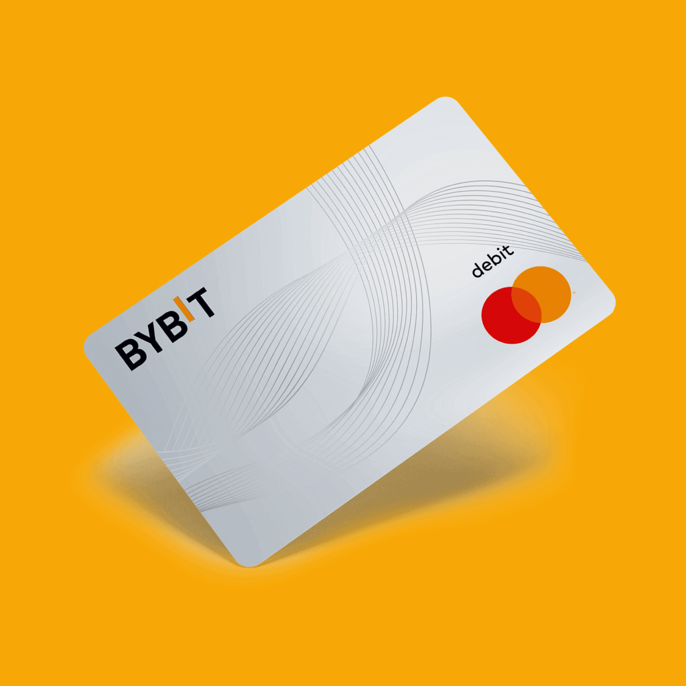

A Flutter application for tracking Bybit Card transactions, rewards, and spending analytics.


## Features

### **Dashboard** — spending summary, category pie chart, daily stacked bar chart with period filter (7D, 30D, 90D, 6M, 1Y, All Time)
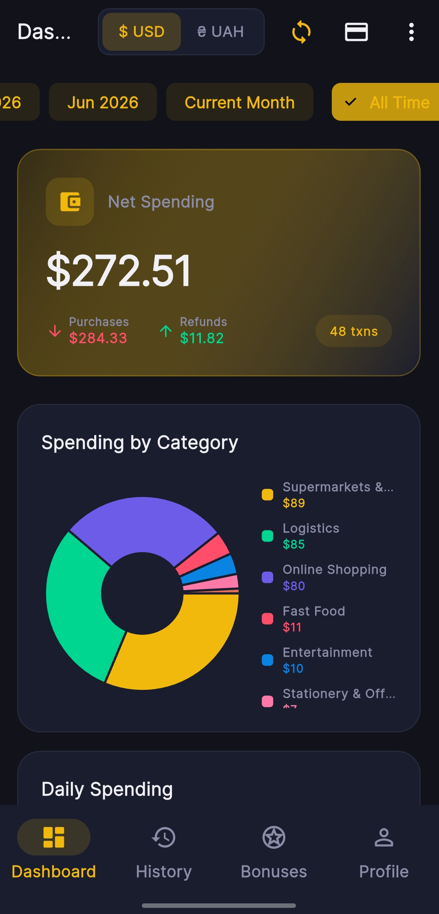

### **Transaction History** — searchable, categorized list with card filter
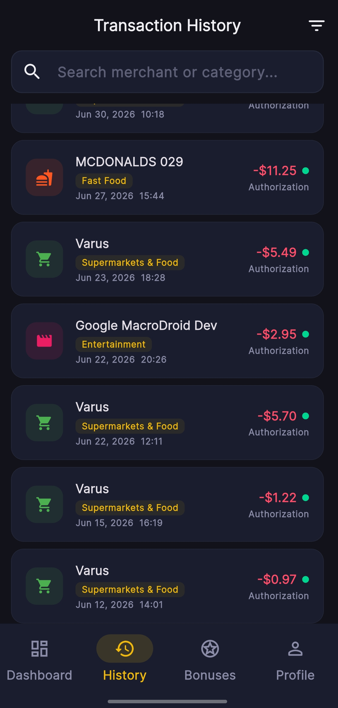

### **Reward Points** — bonus activity history with signed point tracking
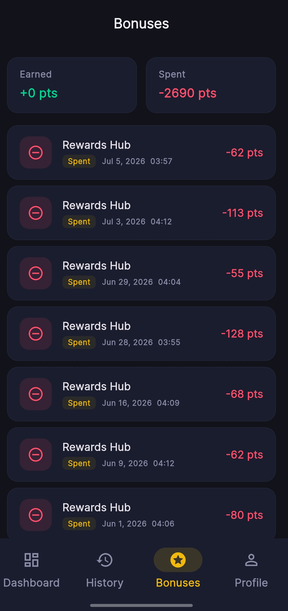

### **Profile & Assets** — card tier, monthly points usage, USDT funding balances with UAH conversion
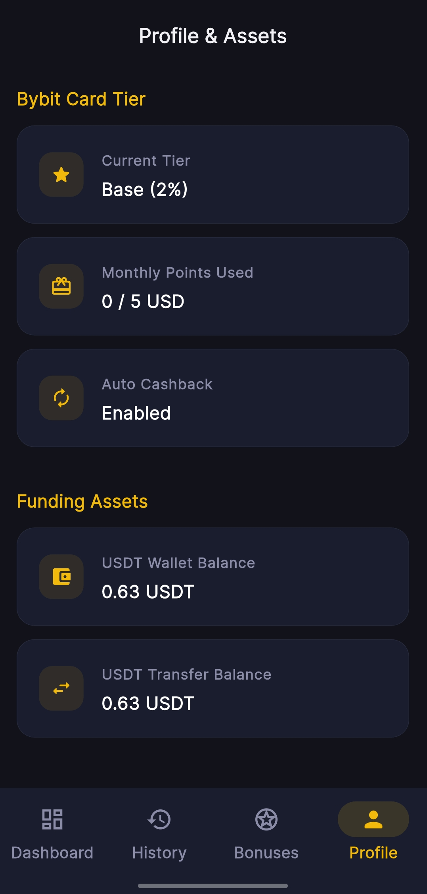

### **Currency Toggle** — switch between USD and UAH; auto-fetch exchange rate from ExchangeRate-API
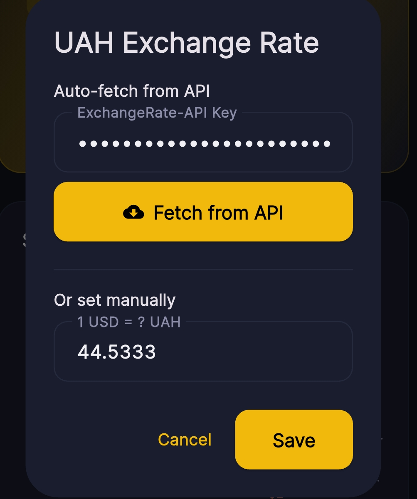

### **Custom Categories** — MCC-based automatic categorization with user-defined override rules
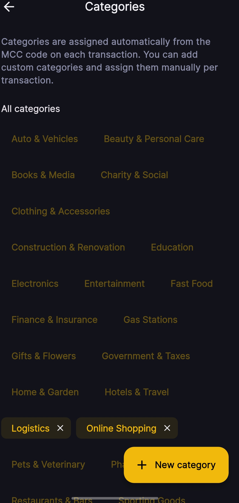

### **Dark Theme** — Material 3 with gold accent and Inter font

## Tech Stack

| Layer | Technology |
|-------|-----------|
| Framework | Flutter / Dart (`sdk ^3.11`) |
| State Management | Riverpod (`flutter_riverpod`) |
| Local Storage | Hive (`hive`, `hive_flutter`) |
| Secure Storage | `flutter_secure_storage` |
| Charts | `fl_chart` |
| API | Bybit v5 (HMAC-SHA256), ExchangeRate-API v6 |
| Linting | `flutter_lints` v6 |

## Getting Started

### Prerequisites

- Flutter SDK 3.11+
- A Bybit account with API key + secret (read-only permissions for asset records and rewards)

### Setup

1. Clone the repo
2. Run `flutter pub get`
3. Launch the app with `flutter run`
4. On first launch, enter your Bybit API key and secret in the Setup screen
5. Optionally configure an ExchangeRate-API key in the exchange rate dialog for auto-fetching UAH rates

### Commands

```sh
flutter pub get        # Install dependencies
flutter run            # Run on connected device
flutter analyze        # Lint check (no typecheck script, no tests)
```

## Architecture

Clean Architecture with four layers:

```
lib/
├── core/          # Constants, theme, error handling, utilities
├── data/          # API datasources, Hive local storage, models, repository implementations
├── domain/        # Entities, repository interfaces (use case layer removed)
└── presentation/  # Screens, widgets, Riverpod providers
```

- The use case layer was removed — providers call repositories directly
- `IndexedStack` in HomeScreen preserves tab state across navigation
- Transactions sync from Bybit API on every app open
- Exchange rate auto-fetches on dashboard load if API key is saved

## API Configuration

### **Bybit**: Requires API key with read permissions for `asset-records` and `reward-points` endpoints
1. Go on web site bybit
2. 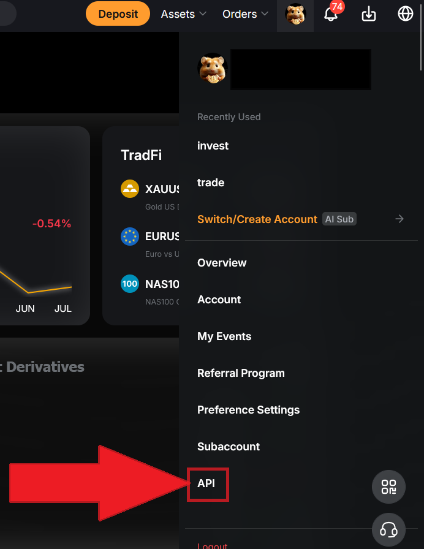
3. 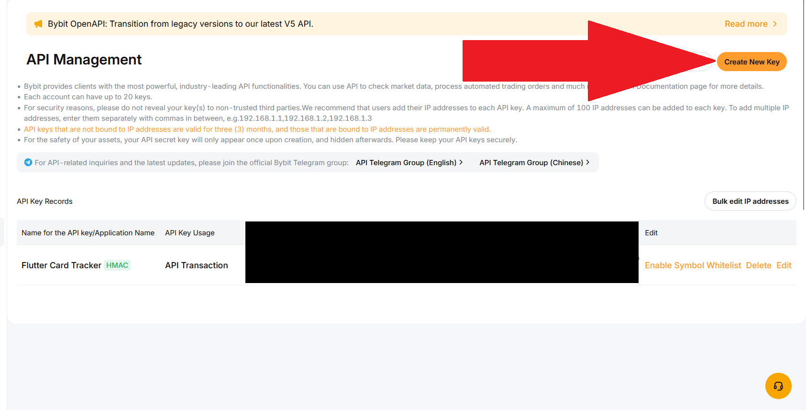
4. 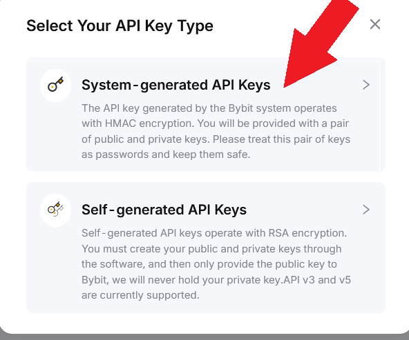
5. 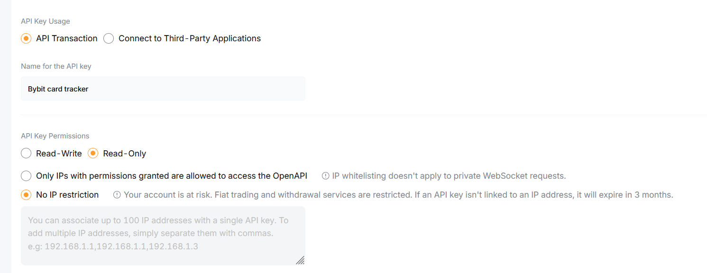
6. 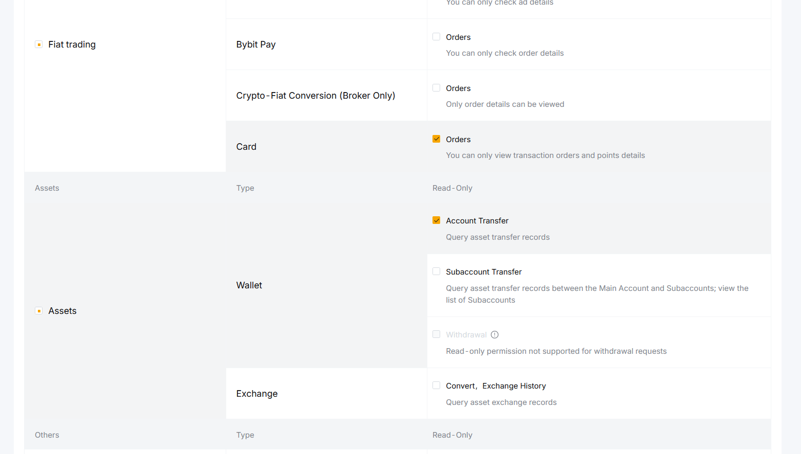

- **ExchangeRate-API**: Free tier key for USD/UAH auto-fetch; entered in the exchange rate dialog and persisted in Hive

